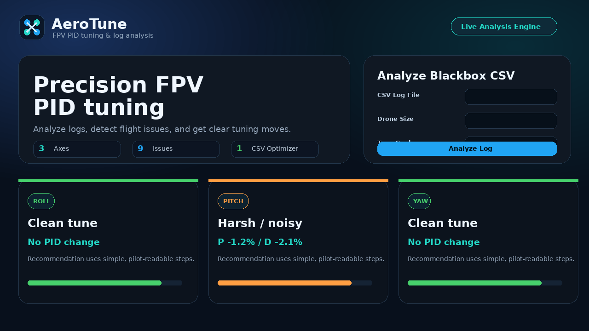
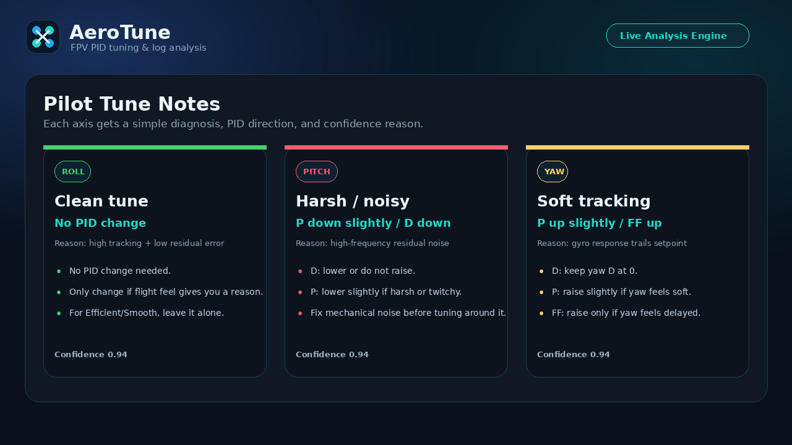
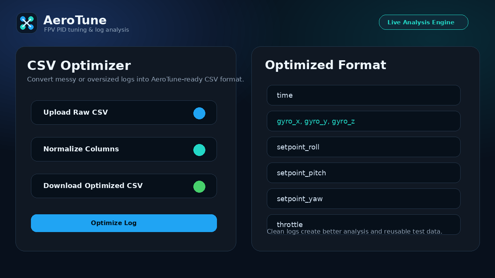

# ⚡ AeroTune

**AeroTune** is a feel-based FPV drone tuning assistant that turns Blackbox CSV logs into clear, pilot-readable PID recommendations.

Instead of overwhelming pilots with raw graphs and confusing numbers, AeroTune translates flight-log behavior into simple tuning decisions:

```text
What is wrong?
What PID term should change?
Why should it change?
What should I test next?
```

---

## 🚀 Demo

### Dashboard



### Axis Recommendations



### CSV Optimizer



---

## ✨ Features

- Upload FPV Blackbox CSV logs
- Analyze roll, pitch, and yaw independently
- Detect common tuning problems
- Get simple PID direction changes instead of fake final PID numbers
- Built-in CSV optimizer for messy or oversized logs
- Pilot-focused recommendations with confidence reasons
- Clean local web UI

---

## 🧠 What AeroTune Detects

AeroTune currently identifies:

- Clean tune
- Propwash / bounceback
- High-frequency noise
- Low-frequency wobble / bounce
- Mid-frequency vibration
- High-throttle oscillation
- Weak hold / drift
- Poor tracking
- Slow stick response

Example output:

```text
ROLL: Propwash detected
Change: D up slightly, P down slightly
Why: D helps damp dirty-air recovery, but motor heat must be checked.
```

---

## 📊 CSV Optimizer

The built-in optimizer converts compatible logs into a standard AeroTune-ready format:

```text
time, gyro_x, gyro_y, gyro_z, setpoint_roll, setpoint_pitch, setpoint_yaw, throttle
```

This helps keep analysis consistent across logs with different column names or large exported files.

---

## 🎯 Why AeroTune Exists

FPV tuning is hard because raw data does not always explain flight feel.

AeroTune bridges the gap between:

```text
Blackbox data → pilot intuition → safe tuning decision
```

It is designed for pilots building or tuning drones with mixed parts, DIY frames, different prop sizes, noisy motors, imperfect filtering, or custom freestyle/cinematic goals.

---

## 🧩 Tuning Modes

### Efficient / Smooth
Conservative tuning for smooth flight, lower heat risk, and stable behavior.

### Locked-In / Responsive
Sharper response and tighter stick feel.

### Floaty / Cinematic
Softer movement for smoother cinematic flying.

---

## ⚙️ Local Setup

Clone the repo:

```bash
git clone https://github.com/bostromdev/AeroTune.git
cd AeroTune
```

Install dependencies:

```bash
python3 -m pip install -r requirements.txt
python3 -m pip install python-multipart
```

Run locally:

```bash
python3 -m uvicorn main:app --reload
```

Open:

```text
http://127.0.0.1:8000
```

---

## 🛠️ Tech Stack

- Python
- FastAPI
- Pandas
- NumPy
- HTML
- CSS
- JavaScript
- FPV Blackbox CSV exports

---

## 📁 Project Structure

```text
AeroTune/
├── app/
│   ├── analyzer.py
│   ├── parser.py
│   ├── main.py
│   └── log_validator.py
├── static/
│   └── index.html
├── assets/
│   └── screenshots/
├── sources.md
├── RELEASE_NOTES.md
├── requirements.txt
└── README.md
```

---

## 📚 References

AeroTune tuning logic is based on established FPV PID tuning principles:

- P controls tracking and sharpness
- I improves attitude hold
- D adds damping for propwash and bounceback but can increase heat/noise
- Feedforward improves stick response
- Yaw D is normally kept at 0

See:

```text
sources.md
```

---

## ⚠️ Disclaimer

AeroTune gives conservative tuning recommendations, not guaranteed final PID values.

Always:

- Make small changes
- Test one change at a time
- Check motor temperature after D-term changes
- Fix mechanical vibration before tuning around it

---

## 🔮 Roadmap

Planned future improvements:

- Before / after tune comparison
- PSD band-energy analysis
- Flight-feel prediction
- Better mobile UI
- Community log examples
- iOS app concept

---

## 👨‍💻 Author

Built by **Christopher Bostrom**

GitHub: [bostromdev](https://github.com/bostromdev)

---

## 💬 Summary

AeroTune helps FPV pilots stop guessing and start making data-backed tuning decisions.
