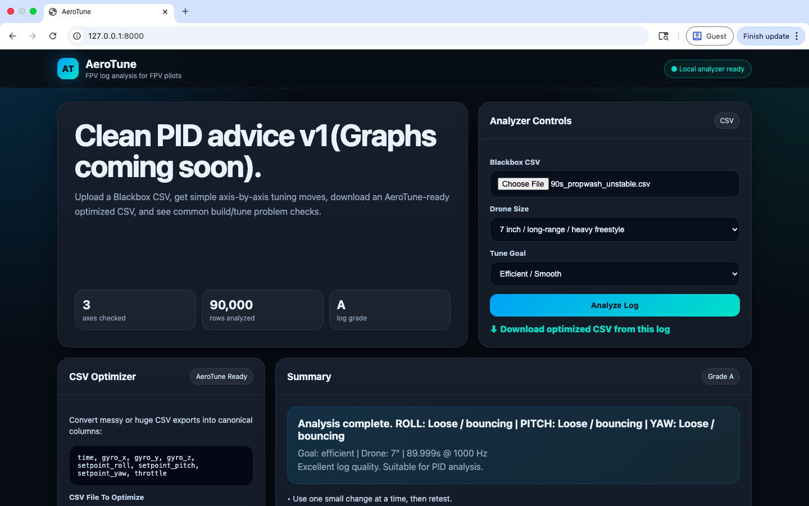
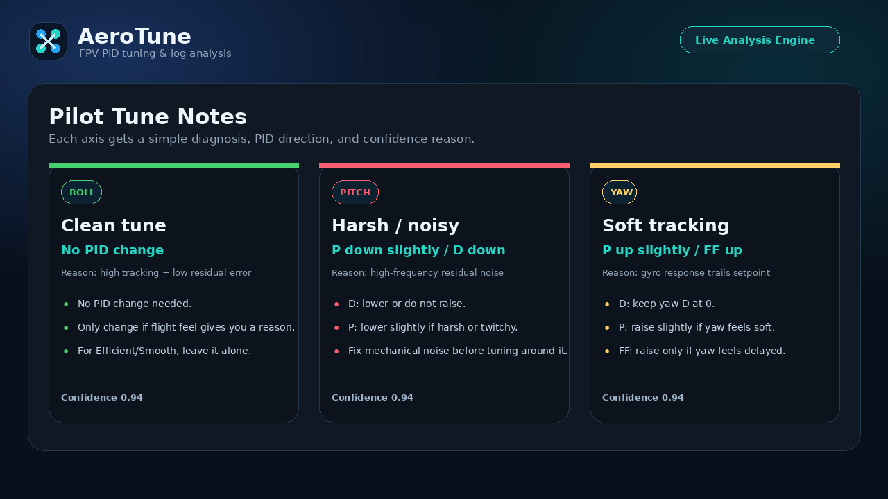
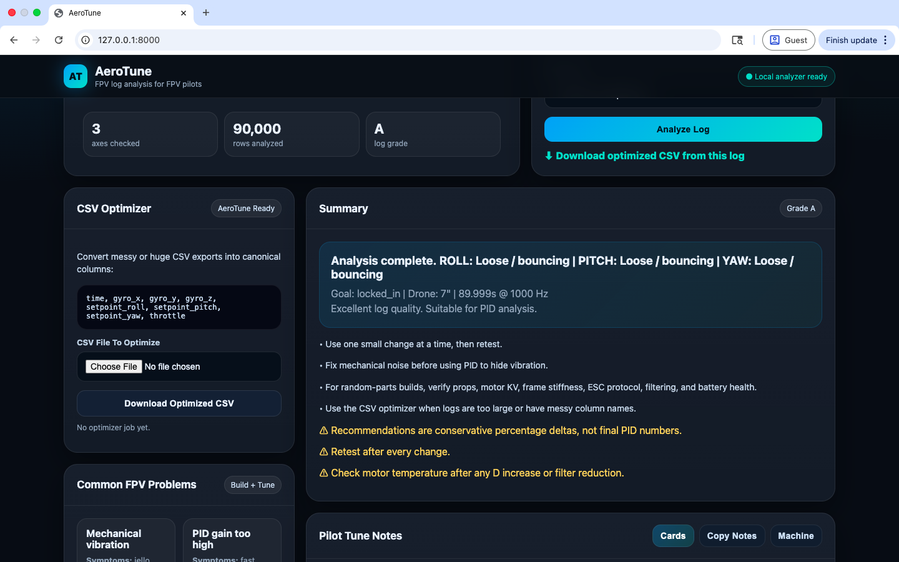

# ⚡ AeroTune

**AeroTune** is a local-first FPV drone tuning assistant that turns Betaflight Blackbox CSV logs into clear, pilot-readable PID recommendations.

Instead of overwhelming pilots with raw graphs and confusing numbers, AeroTune translates flight-log behavior into simple tuning decisions:

```text
What is wrong?
What PID term should change?
Why should it change?
What should I test next?
```

---

## Current Status

AeroTune is an early engineering project, not a finished commercial PID tuner.

The goal is to test whether Betaflight Blackbox CSV logs can be translated into useful, feel-based tuning recommendations using known FPV PID tuning principles.

AeroTune supports **Betaflight CSV exports** directly. V1.3 adds optional raw `.bbl`, `.bfl`, and `.txt` upload support by using a locally installed `blackbox_decode` converter. V1.4 adds before/after multi-log comparison so pilots can check whether a tune change improved or worsened the flight data.

Some newer Betaflight firmware versions may export CSV files with different column names or structure. AeroTune V1.1 / V1.2 focuses on making the parser stronger and showing clear parser diagnostics instead of failing silently.

---

## Engineering Goal

AeroTune is being built as a practical engineering project to prove capability in:

- data analysis
- control-system thinking
- FPV flight tuning logic
- parser design for real-world exported logs
- before/after validation using real flight data

The project is not intended to replace pilot judgment or official Betaflight documentation. It is meant to turn existing PID theory into a repeatable analysis workflow, then improve that workflow using real before/after flight logs.

The long-term goal is to compare recommendations against real flight results and make the analyzer more accurate over time.

---

## Notice

AeroTune is an independent open-source FPV Blackbox analysis project created by **Christopher Bostrom / bostromdev**.

This project is not affiliated with AeroTune7, aerobot2.com, or any similarly named paid tuning tool.

AeroTune is being built as a free engineering project for FPV pilots, developers, and researchers. Collaborators and testers who provide useful CSV logs may be credited in the project as the validation dataset grows.

---

## Why AeroTune Runs Locally

AeroTune is designed as a **local-first tool**.

FPV Blackbox CSV logs can be large, especially when recording longer flights or high-rate gyro data. Running AeroTune locally avoids common web-hosting issues such as:

- upload limits
- request timeouts
- slow processing
- failed large-file uploads
- hosted demo file-size restrictions

Local use also keeps flight logs on the pilot’s own machine instead of forcing uploads to a server.

For this stage of the project, local-first development keeps AeroTune practical, fast, and easier to maintain as a solo-built tool.

---

## Dashboard



## Axis Recommendations



## CSV Optimizer



---

## Recommended Blackbox Test Flight

For the best AeroTune results, do **not** upload a random hover-only log.

AeroTune works best when each CSV comes from a repeatable Blackbox test flight that gives the analyzer enough useful movement to compare:

- gyro behavior
- setpoint tracking
- throttle response
- propwash recovery
- vibration
- general tune feel

Recommended flight:

- Record about **60–90 seconds** of clean Blackbox data.
- 90 seconds is ideal when possible.
- Use the same basic flight style every time you test a tune change.
- Include smooth normal flying, not just hovering.
- Add a few controlled throttle punches.
- Add medium turns, quick stops, and direction changes.
- Add some dirty-air recovery / propwash moments if safe.
- Keep the flight controlled and repeatable.
- Avoid crashes, bumps, heavy wind, or damaged props during test logs.

When comparing two tune changes, repeat the same basic flight pattern for both CSV files. This is important.

If one CSV is only smooth cruising and the next CSV has hard throttle punches, AeroTune may be comparing different flying conditions instead of the actual tune change.

Best practice:

```text
Same drone
Same props
Same battery type
Same tune goal
Same Blackbox settings
Same approximate flight length
Same style of test flight
```

Example test log:

```text
90-second Blackbox log:
- smooth cruise
- small roll/pitch/yaw inputs
- a few throttle punches
- a few turns
- one or two propwash recovery moments
```

This gives AeroTune a better chance to identify real issues like propwash, bounceback, weak hold, poor tracking, high-throttle oscillation, or excess vibration.

---

## How to Export Your Blackbox CSV

AeroTune analyzes **CSV files directly**. It can also accept raw `.BBL`, `.BFL`, or `.TXT` Blackbox logs when Betaflight's `blackbox_decode` tool is installed locally.

The easiest beginner workflow is still CSV export:

1. Open **Betaflight Blackbox Explorer**.
2. Click **Open log file/video**.
3. Select your Blackbox log file from your flight controller, SD card, or computer.
4. Pick the correct flight/log inside the file if the file contains multiple logs.
5. Use **Export CSV**.
6. Save the exported `.csv` file somewhere easy to find.
7. Upload that `.csv` into AeroTune.

Raw-log workflow:

1. Build or install `blackbox_decode` locally.
2. Upload the raw `.bbl`, `.bfl`, or `.txt` file directly.
3. AeroTune converts it to CSV internally, then runs the normal parser/analyzer.

Recommended naming style:

```text
7inch_6s_90s_smooth_punches_before.csv
7inch_6s_90s_smooth_punches_after.csv
```

Keep the original Blackbox log too. The CSV is for AeroTune, but the raw log is still useful if you need to reopen it in Blackbox Explorer later.

Best CSV export checklist:

- Export the same flight you want AeroTune to analyze.
- Prefer a 60–90 second test flight.
- Avoid exporting crash-only logs unless you are diagnosing a crash.
- Name the file clearly so you know the drone size, battery, test type, and whether it was before or after a tune change.
- If the exported CSV is too large for a hosted demo, run AeroTune locally.

Advanced users can also use command-line Blackbox tools to decode supported logs into CSV, but beginners should start with Betaflight Blackbox Explorer.

---

## Features

- Upload FPV Blackbox CSV logs
- Upload raw `.bbl`, `.bfl`, and `.txt` logs when `blackbox_decode` is installed locally
- Analyze roll, pitch, and yaw independently
- Detect common tuning problems
- Get simple PID direction changes instead of fake final PID numbers
- Built-in CSV optimizer for messy or oversized logs
- Parser diagnostic report for supported CSV files
- Pilot-focused recommendations with confidence reasons
- Clean local web UI
- Drone size profiles for 3", 3.5", 4", 5", and 7" builds
- Local-first analysis for privacy and large CSV support
- Conservative PID percentage-change recommendations
- V1.4 before/after log comparison for tune validation

---

## V1.1 / V1.2 Parser Diagnostic Update

AeroTune V1.1 / V1.2 improves the parser so users can understand exactly what happened when a CSV loads or fails.

Added:

- Parser returns `parser_report` instead of failing silently
- UI shows detected time column
- UI shows detected gyro columns
- UI shows detected setpoint columns
- UI shows detected throttle column
- UI shows missing required columns
- UI shows missing optional columns
- UI shows sample rate
- UI shows duration
- UI shows usable rows
- UI shows repeated header / metadata cleanup
- Backend `/upload-log` returns `parser_report`
- Backend `/optimize-log` returns `parser_report`
- Optimizer now downloads CSV after returning JSON report
- Raw `.bbl`, `.bfl`, and `.txt` files now route through the V1.3 converter when `blackbox_decode` is available

This update helps users diagnose:

- missing time columns
- missing gyro columns
- logs that are too short
- strange sample rates
- non-CSV uploads
- repeated headers
- metadata rows inside Betaflight CSV exports
- newer Betaflight CSV exports with different column names

---


## V1.3 Raw Blackbox Log Converter

AeroTune V1.3 adds optional raw Blackbox upload support.

Supported upload types:

```text
.csv
.bbl
.bfl
.txt
```

CSV files are analyzed directly.

Raw `.bbl`, `.bfl`, and `.txt` files are first converted into CSV using Betaflight's `blackbox_decode` tool, then passed through AeroTune's parser and analyzer.

AeroTune does **not** bundle `blackbox_decode` inside this repository. The converter must be installed locally or pointed to with an environment variable:

```bash
export BLACKBOX_DECODE_PATH="$PWD/tools/blackbox-tools/obj/blackbox_decode"
```

AeroTune searches for `blackbox_decode` in this order:

```text
1. BLACKBOX_DECODE_PATH
2. tools/blackbox-tools/obj/blackbox_decode
3. system PATH
```

Recommended local setup:

```bash
mkdir -p tools
if [ ! -d tools/blackbox-tools/.git ]; then
  git clone https://github.com/betaflight/blackbox-tools.git tools/blackbox-tools
else
  git -C tools/blackbox-tools pull --ff-only
fi

make -C tools/blackbox-tools obj/blackbox_decode
export BLACKBOX_DECODE_PATH="$PWD/tools/blackbox-tools/obj/blackbox_decode"
$BLACKBOX_DECODE_PATH --help
```

Why the converter is separate:

- `blackbox_decode` is part of Betaflight / blackbox-tools.
- The `blackbox_decode` help output credits Nicholas Sherlock as the Blackbox flight log decoder author.
- AeroTune uses `blackbox_decode` only as an optional local converter for raw `.bbl`, `.bfl`, and `.txt` logs.
- AeroTune does not bundle or redistribute the `blackbox_decode` binary.
- Keeping it external avoids bundling a separate GPL-licensed binary inside AeroTune.
- CSV exports remain the safest fallback for all users.

The UI now shows both:

```text
Converter Report
Parser Report
```

This makes failures easier to understand. For example, if a raw `.bfl` file fails, AeroTune can tell whether the problem is missing converter setup, failed conversion, or parser column detection.


## V1.4 Multi-Log Comparison

AeroTune V1.4 adds a before/after comparison workflow.

Upload:

```text
Before tune log
After tune log
```

AeroTune analyzes both logs using the same parser, converter, drone-size profile, and tuning goal. It then compares the after log against the before log and answers:

```text
Did it improve?
Did it get worse?
Which axis changed most?
What metric changed most?
What should I test next?
```

V1.4 compares lower-is-better metrics:

- tracking error ratio
- 95th-percentile absolute error
- propwash-band energy
- high-frequency noise ratio
- absolute tracking lag

The comparison output includes:

- overall verdict
- overall improvement score
- comparison confidence
- roll / pitch / yaw comparison cards
- strongest improvement axis
- weakest axis
- next-step recommendation
- machine-readable JSON output

Important: before/after comparison only works well when both logs come from similar flights.

Best comparison practice:

```text
Same drone
Same battery type
Same props
Same tune goal
Same approximate flight length
Same test route
Same kind of throttle punches / turns / propwash recovery
```

If the two flights are very different, AeroTune will still compare them, but the confidence may be lower.

---

## What AeroTune Detects

AeroTune currently identifies:

- Clean tune
- Propwash / bounceback
- High-frequency noise
- Low-frequency wobble / bounce
- Mid-frequency vibration
- High-throttle oscillation
- Weak hold / drift
- Poor tracking
- Slow stick response

Example output:

```text
ROLL: Propwash detected
Change: D up slightly, P down slightly
Why: D helps damp dirty-air recovery, but motor heat must be checked.
```

---

## CSV Optimizer

The built-in optimizer converts compatible logs into a standard AeroTune-ready format:

```text
time, gyro_x, gyro_y, gyro_z,
setpoint_roll, setpoint_pitch, setpoint_yaw, throttle
```

This helps keep analysis consistent across logs with different column names or large exported files.

Note: CSV exports still work without any extra tool. Raw `.bbl`, `.bfl`, and `.txt` Blackbox logs require `blackbox_decode` to be installed locally or available through `BLACKBOX_DECODE_PATH`.

---

## Why AeroTune Exists

FPV tuning is hard because raw data does not always explain flight feel.

AeroTune bridges the gap between:

```text
Blackbox data → pilot intuition → safe tuning decision
```

It is designed for pilots building or tuning drones with mixed parts, DIY frames, different prop sizes, noisy motors, imperfect filtering, or custom freestyle/cinematic goals.

---

## Tuning Modes

### Efficient / Smooth

Conservative tuning for smooth flight, lower heat risk, and stable behavior.

### Locked-In / Responsive

Sharper response and tighter stick feel.

### Floaty / Cinematic

Softer movement for smoother cinematic flying.

---

## Local Setup

Clone the repo:

```bash
git clone https://github.com/bostromdev/AeroTune.git
cd AeroTune
```

Install dependencies:

```bash
python3 -m pip install -r requirements.txt
python3 -m pip install python-multipart
```

Run locally:

```bash
python3 -m uvicorn main:app --reload
```

Open:

```text
http://127.0.0.1:8000
```

---

## Tech Stack

- Python
- FastAPI
- Pandas
- NumPy
- HTML
- CSS
- JavaScript
- FPV Blackbox CSV exports

---

## Project Structure

```text
AeroTune/
├── app/
│   ├── analyzer.py
│   ├── parser.py
│   ├── main.py
│   └── log_validator.py
├── static/
│   ├── index.html
│   └── favicon.svg
├── assets/
│   └── screenshots/
├── sources.md
├── RELEASE_NOTES.md
├── requirements.txt
└── README.md
```

---

## References

AeroTune tuning logic is based on established FPV PID tuning principles:

- P controls tracking and sharpness
- I improves attitude hold
- D adds damping for propwash and bounceback but can increase heat/noise
- Feedforward improves stick response
- Yaw D is normally kept at 0

See:

```text
sources.md
```

---

## License

AeroTune is released under the Apache License 2.0.

You are free to use, modify, fork, study, and build from this project.

If you publish or redistribute work based on AeroTune, please keep the license notice and give credit where reasonable:

```text
Based on AeroTune by Christopher Bostrom
```

The goal is to encourage FPV pilots, developers, and researchers to use and improve the project while keeping clear attribution to the original creator.

---

## Disclaimer

AeroTune gives conservative tuning recommendations, not guaranteed final PID values.

Always:

- Make small changes
- Test one change at a time
- Check motor temperature after D-term changes
- Fix mechanical vibration before tuning around it
- Confirm flight behavior with safe test flights

---

## Roadmap

### V1 — Betaflight CSV export support

Status: mostly complete.

AeroTune currently supports Betaflight Blackbox CSV exports and local analysis through the web UI.

### V1.1 — Stronger parser for unusual Betaflight CSV exports

Status: in progress.

Goal: make the parser more tolerant of weird CSV exports, repeated headers, metadata rows, unusual time units, and inconsistent column names.

### V1.2 — Auto-detect firmware/export column names

Status: partially implemented.

Goal: detect common Betaflight / Blackbox Explorer column variants and show a clear parser report explaining what was found.

### V1.3 — Native `.bbl` / `.bfl` / `.txt` upload support

Status: implemented as a local-converter workflow.

Goal: allow raw Blackbox logs to be uploaded, converted to CSV through `blackbox_decode`, then analyzed by AeroTune.

### V1.4 — Multi-log comparison

Status: implemented.

Goal: compare before-tune and after-tune logs to determine whether noise, tracking, propwash, bounceback, and control response improved.

Implementation:

- `/compare-logs` endpoint
- before/after upload UI
- roll/pitch/yaw comparison cards
- overall improvement score
- confidence notes and next-step guidance

### V1.5 — Tune-change tracking

Status: planned.

Goal: let users record what PID/filter/rate changes they made, then compare the resulting flight logs to see whether the change helped or hurt.

Future improvements:

- Saved before / after tune records
- Flight-feel prediction
- Community log examples
- Better support for newer Betaflight CSV formats
- More flexible column detection
- Real before/after log validation
- Public test-log dataset

---

## Author

Built by **Christopher Bostrom**

GitHub: [bostromdev](https://github.com/bostromdev)

---

## Summary

AeroTune is a local-first Betaflight Blackbox CSV analyzer for feel-based PID tuning.

It is an engineering project focused on turning real flight-log data into clear, conservative tuning suggestions, then validating those suggestions through before/after testing.
